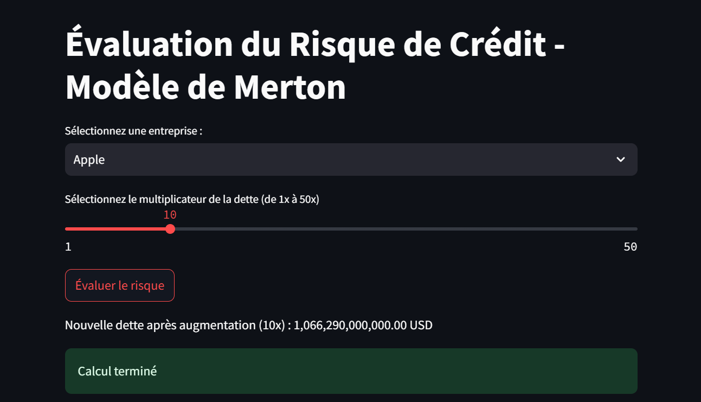
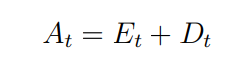
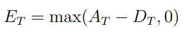
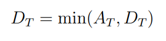
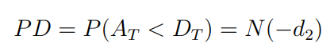
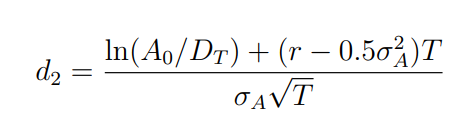
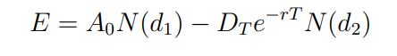
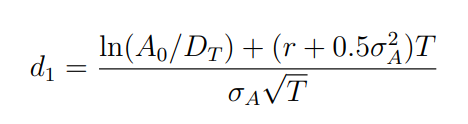
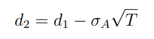
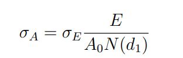

## 🌍 🔥 **Testez l'application en direct !** 🔥 🌍  

🔗 **[CLIQUEZ ICI POUR ESSAYER L'APPLICATION](https://blank-app-5mji6hzloal.streamlit.app/)**  

---


## 📌 **Introduction**
Le modèle de **Merton** repose sur l'idée que la **valeur des actifs** d'une entreprise suit un **processus stochastique** et que les actionnaires possèdent une **option d'achat implicite** sur ces actifs.  
L’entreprise **fait défaut** si la valeur de ses actifs est **inférieure à la dette** à l'échéance **T**.

---
### **🏦 Définition de la Valeur des Actifs**
---
À tout instant \(t\), la valeur des actifs d'une entreprise \(A_t\) est donnée par la somme des **capitaux propres** \(E_t\) et de la **dette** \(D_t\) :

📌 **Formule :**


📌 **Correspondance dans le Code :**  
Dans le modèle de Merton, nous **ne connaissons pas directement** \(A_t\), c’est pourquoi nous devons le **retrouver par optimisation**.  
La **relation comptable** \(A_t = E_t + D_t\) est **notre point de départ**, mais nous devons aussi assurer **la cohérence avec la volatilité observée des capitaux propres**.

```python
initial_guess = [E + D, sigma_E]
```
- On suppose **initialement** que \( A_0 \) est la **somme de la dette et de la capitalisation boursière**.
- Mais **ce n'est qu'une estimation** : la véritable valeur de \( A_0 \) sera trouvée **par optimisation**.

---

### **🔄 Scénarios Possibles à Maturité \( T \)**
---
À la date d'échéance \(T\), **deux scénarios sont possibles** :

📌 **Si la valeur des actifs dépasse la dette** \(A_T > D_T\), alors **les actionnaires récupèrent** :



📌 **Si la valeur des actifs est inférieure à la dette** \(A_T < D_T\), alors **l'entreprise est en défaut** et les créanciers récupèrent :



📌 **Correspondance dans le Code :**
La **fonction `equity_value()`** met en place cette logique en appliquant la formule de Black-Scholes pour estimer les capitaux propres :

```python
def equity_value(A, D, T, r, sigma_A):
    d1_val = d1(A, D, T, r, sigma_A)
    d2_val = d2(d1_val, sigma_A, T)
    return A * norm.cdf(d1_val) - D * np.exp(-r * T) * norm.cdf(d2_val)
```
- **Si \( A_T > D_T \) → les actionnaires reçoivent \( A_T - D_T \) (call option).**
- **Si \( A_T < D_T \) → l’entreprise est en défaut et les créanciers récupèrent \( A_T \).**

---

### **⚠️ Modélisation du Risque de Défaut**
---
📌 **Formule :**
La **probabilité de défaut** est définie par :



où \(N(\cdot)\) est la fonction de répartition de la **loi normale standard**.

Le paramètre \(d_2\) est défini comme :



📌 **Correspondance dans le Code :**
La **fonction `probability_of_default()`** applique cette formule pour calculer la **probabilité que l’entreprise fasse défaut** à l’échéance \(T\).

```python
def probability_of_default(A0, D, T, r, sigma_A):
    d2_val = (np.log(D / A0) - (r - 0.5 * sigma_A**2) * T) / (sigma_A * np.sqrt(T))
    return norm.cdf(d2_val)  # Fonction de répartition normale cumulative
```
- **\( d_2 \)** est **calculé via la formule de Black-Scholes**.
- **Le `norm.cdf(d2_val)` donne directement la probabilité de défaut.**

---

### **📈 Formules de Black-Scholes adaptées au Modèle de Merton**
---
Le **modèle de Merton** assimile la **valeur des capitaux propres** à une **option d'achat** sur les actifs de l'entreprise.  
On utilise donc la **formule de Black-Scholes** :

📌 **Formule :**


Avec :





📌 **Correspondance dans le Code :**
Les **fonctions `d1()` et `d2()`** permettent de calculer ces paramètres.

```python
def d1(A, D, T, r, sigma_A):
    return (np.log(A / D) + (r + 0.5 * sigma_A**2) * T) / (sigma_A * np.sqrt(T))

def d2(d1, sigma_A, T):
    return d1 - sigma_A * np.sqrt(T)
```
- **\( d_1 \) et \( d_2 \)** sont **nécessaires pour estimer les capitaux propres**.
- Ces paramètres permettent de **convertir la volatilité des actifs en une estimation des capitaux propres \( E \)**.

---

### **📊 Estimation de la Volatilité des Actifs**
---
📌 **Formule :**
La **volatilité des actifs** \(\sigma_A\) est estimée à partir de la **volatilité des capitaux propres** \(\sigma_E\) :



📌 **Correspondance dans le Code :**
La **fonction `asset_volatility()`** applique cette formule pour relier **\(\sigma_E\) et \(\sigma_A\)**.

```python
def asset_volatility(A, E, sigma_E, T, r):
    return sigma_E * (E / (A * norm.cdf(d1(A, D, T, r, sigma_E))))
```
- On **observe \(\sigma_E\)** directement sur le marché (via les prix des actions).
- On **calcule \(\sigma_A\)** de manière **cohérente avec la dynamique du modèle de Merton**.

---

### **🔎 Pourquoi avons-nous besoin d'une optimisation ?**
Dans l’équation comptable **\( A = E + D \)** :
- Nous connaissons **\( E \)** et **\( D \)**.
- Mais **nous ne connaissons pas la volatilité des actifs \( \sigma_A \)**.

Le programme **optimise** \( A \) et \( \sigma_A \) pour **assurer la cohérence entre les prix du marché et les mathématiques du modèle**.

📌 **Optimisation dans le Code :**
```python
def objective(x, D, E, T, r, sigma_E):
    A, sigma_A = x  # Variables à optimiser
    E_estimated = equity_value(A, D, T, r, sigma_A)  # Estimation de E via Black-Scholes
    sigma_A_estimated = asset_volatility(A, E, sigma_E, T, r)  # Calcul de σ_A estimé
    return (E_estimated - E)**2 + (sigma_A_estimated - sigma_A)**2  # Minimisation des erreurs
```
- On **minimise l'erreur** entre :
  1. La valeur estimée des capitaux propres.
  2. La volatilité calculée des actifs.

---

### **🔧 Interface Utilisateur : Interaction avec Streamlit**
L’utilisateur peut :
✅ **Sélectionner une entreprise** via un menu déroulant.  
✅ **Choisir un multiplicateur de la dette** pour simuler un **scénario catastrophe**.  

📌 **Correspondance dans le Code :**
```python
multiplier = st.slider("Sélectionnez le multiplicateur de la dette (de 1x à 50x)", 1, 50, 10)
```
- Permet **d’augmenter artificiellement la dette** pour voir **comment la probabilité de défaut évolue**.

📌 **Application des scénarios de dette :**
```python
D *= multiplier
st.write(f"Nouvelle dette après augmentation ({multiplier}x) : {D:,.2f} USD")
```
- **Augmente la dette** et affiche **le nouveau montant total**.

---

### **🏁 Conclusion**
- 🔥 **Le modèle de Merton est une application de Black-Scholes aux entreprises.**
- 📊 **Les capitaux propres sont traités comme une option d'achat sur les actifs.**
- ⚠️ **On optimise \( A \) et \( \sigma_A \) pour assurer la cohérence avec les données de marché.**
- 🚀 **L'interface interactive permet d'expérimenter des scénarios de crise et d’observer l’évolution du risque de défaut.**
